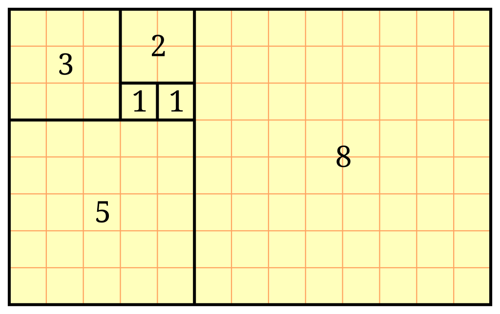

# Successió de Fibonacci

La successió de Fibonacci és una successió matemàtica de nombres naturals tal que cada un dels seus termes és igual a la suma dels dos anteriors. Aquesta successió va ser descrita per primera vegada per Leonardo de Pisa Fibonacci i cadascun dels seus termes rep el nom de nombre de Fibonacci.

Si es pren una successió de nombres naturals de tal forma que els dos primers termes siguen

    F(0) = 0
    F(1) = 1

i cadascun dels següents termes és la suma dels dos anteriors:

    F(n) = F(n-2) + F(n-1)

Aquesta successió queda definida per recursivitat com:

F ( n ) = 0 , si  n = 0

F ( n ) = 1 , si  n = 1

F ( n ) = 1 , si  n = 2

F ( n ) = F ( n − 1 ) + F ( n − 2 ), si n > 2

Els vint primers termes d'aquesta successió són: 1 	1 	2 	3 	5 	8 	13 	21 	34 	55 	89 	144 233 377 610 987 1597 2584 	4181 6765
